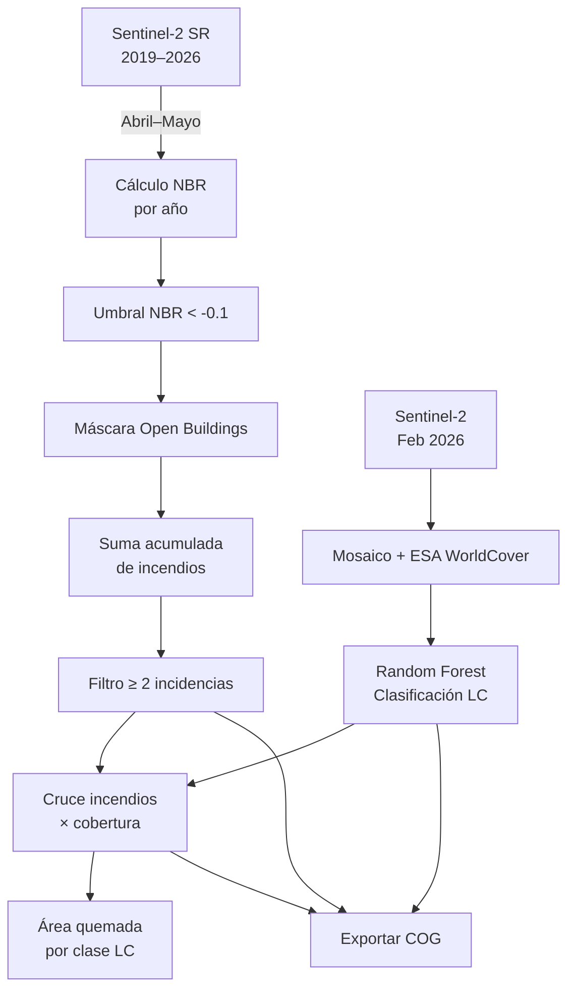

# 🔥 Incidencias de Quemas — Liberia, Guanacaste (2019–2026)
Visor geografico en siguiente link:  https://asoto59g.github.io/Incendios_Guanacaste_2026/

Análisis multitemporal de incendios forestales y su relación con la cobertura del suelo en cinco cantones de la provincia de Guanacaste, Costa Rica, utilizando **Google Earth Engine (GEE)** y **QGIS**.

---

## 📍 Área de Estudio

Cantones analizados:

| Cantón | Provincia |
|---|---|
| Liberia | Guanacaste |
| La Cruz | Guanacaste |
| Carrillo | Guanacaste |
| Santa Cruz | Guanacaste |
| Bagaces | Guanacaste |

---

## 📁 Estructura del Repositorio

```
├── quemas_liberia.js                       # Script de Google Earth Engine
├── Incidencia 2019-2026.qgs                # Proyecto QGIS para visualización
├── incendios.tif                           # Ráster de incendios acumulados (GeoTIFF / COG)
├── Incidencia 2019-2026_attachments.zip    # Adjuntos del proyecto QGIS
├── 🔥 Prácticas preventivas.docx           # Documento con prácticas preventivas de quemas
└── README.md                               # Este archivo
```

---

## 🛰️ Script de Google Earth Engine (`quemas_liberia.js`)

Script ejecutable en el [Code Editor de GEE](https://code.earthengine.google.com/) que realiza las siguientes etapas:

### 1. Definición del área de estudio
Filtra los cantones de interés desde la colección vectorial `users/oasotob/CantonesCR` usando el campo `NCANTON`.

### 2. Exclusión de edificaciones (Google Open Buildings v3)
Utiliza la colección [`GOOGLE/Research/open-buildings/v3/polygons`](https://developers.google.com/earth-engine/datasets/catalog/GOOGLE_Research_open-buildings_v3_polygons) para generar una máscara que excluye áreas construidas del análisis de incendios, evitando falsos positivos por superficies urbanas.

### 3. Clasificación de cobertura del suelo (Land Cover 2026)
- Mosaico Sentinel-2 de febrero 2026 (`COPERNICUS/S2`) con < 10% nubosidad.
- Entrenamiento supervisado usando **ESA WorldCover v200** como referencia de clases.
- Clasificador: **Random Forest** (4 árboles) con 5,000 puntos de muestreo estratificado.
- **11 clases** de cobertura: bosque, arbustos, pastizales, cultivos, urbano, suelo desnudo, cuerpos de agua, humedales, manglar, nieve/hielo, musgo/líquenes.

### 4. Detección de incendios acumulados (2019–2026)
Para cada año del periodo:
- Se filtran imágenes **Sentinel-2 SR Harmonized** (`COPERNICUS/S2_SR_HARMONIZED`) en la ventana de abril–mayo (temporada seca / post-quema).
- Se calcula el **NBR** (Normalized Burn Ratio): `(B8 − B12) / (B8 + B12)`.
- Se umbraliza con `NBR < -0.1` para identificar áreas quemadas.
- Se excluyen edificaciones con la máscara de Open Buildings.
- Se suman las detecciones anuales para obtener una **frecuencia acumulada de incendios**.
- Se aplica una máscara final que conserva solo píxeles con **≥ 2 incidencias**.

### 5. Cruce: Incendios × Cobertura
Superpone la clasificación de cobertura sobre las áreas quemadas para determinar **qué tipo de cobertura se ve más afectada** por los incendios recurrentes.

### 6. Cálculo de áreas quemadas
Usa `ee.Image.pixelArea()` con `ee.Reducer.sum().group()` para calcular el área quemada (m²) desglosada por clase de cobertura.

### 7. Exportaciones a Google Drive
Se exportan tres productos en formato **Cloud Optimized GeoTIFF (COG)** a la carpeta `GEE_Liberia`:

| Archivo | Descripción |
|---|---|
| `incendios.tif` | Frecuencia acumulada de incendios (2019–2026) |
| `landcover.tif` | Clasificación de cobertura del suelo 2026 |
| `fire_lc.tif` | Cruce de incendios por tipo de cobertura |

Resolución: **10 m/px**

---

## 🗺️ Proyecto QGIS (`Incidencia 2019-2026.qgs`)

Proyecto de **QGIS 3.40 (Bratislava)** en CRS **WGS 84 (EPSG:4326)** que integra las siguientes capas para la visualización y análisis de los resultados:

| Capa | Tipo | Fuente |
|---|---|---|
| **Incendios** | Ráster local | `incendios.tif` — resultado de GEE |
| **Propietarios Zona 1** | WMS | SNITCR — capa `catastro` |
| **Propietarios Zona 2** | WMS | SNITCR — capa `catastro_aldia` |
| **Google Hybrid** | XYZ Tiles | Mapa base satelital + etiquetas |

> Las capas catastrales del SNITCR (`siri.snitcr.go.cr`) permiten identificar a los propietarios de las fincas afectadas por incendios recurrentes.

---

## 📄 Documento de prácticas preventivas

El archivo `🔥 Prácticas preventivas.docx` contiene lineamientos y recomendaciones para la prevención de quemas no controladas en la zona de estudio.

---

## ⚙️ Requisitos

| Herramienta | Versión mínima |
|---|---|
| [Google Earth Engine](https://earthengine.google.com/) | Cuenta activa con acceso al Code Editor |
| [QGIS](https://qgis.org/) | 3.28+ (recomendado 3.40+) |

### Uso del script GEE

1. Abrir el [Code Editor de GEE](https://code.earthengine.google.com/).
2. Copiar el contenido de `quemas_liberia.js` en el editor.
3. Hacer clic en **Run**.
4. Los resultados se visualizan en el mapa y las exportaciones se inician desde la pestaña **Tasks**.

### Uso del proyecto QGIS

1. Abrir `Incidencia 2019-2026.qgs` en QGIS.
2. El archivo `incendios.tif` debe estar en el mismo directorio que el `.qgs`.
3. Se requiere conexión a internet para las capas WMS (SNITCR) y XYZ (Google Hybrid).

---

## 📊 Metodología Resumida



---

## 👤 Autor

**Alejandro Soto Barquero**  
ABC Geomática Agrícola SRL

---

## 📜 Licencia

Este proyecto está licenciado bajo la [Licencia MIT](LICENSE).
